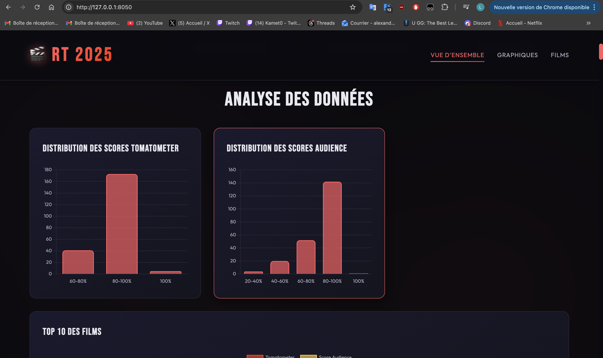

# 🎬 Scraping des films Rotten Tomatoes 2025 & Dashboard interactif

## 📋 Table des matières

- [Présentation du projet](#-présentation-du-projet)
- [Architecture](#️-architecture)
- [Prérequis](#-prérequis)
- [Installation](#-installation)
- [Utilisation](#-utilisation)
- [Stack technique](#-stack-technique)
- [Fonctionnalités](#-fonctionnalités)
- [Aperçu du dashboard](#-aperçu-du-dashboard)
- [Difficultés rencontrées](#️-difficultés-rencontrées)
- [Améliorations possibles](#-améliorations-possibles)
- [Auteur](#-auteur)

---

## 🎯 Présentation du projet

Ce projet a été réalisé dans le cadre du module de **Data Engineering**. L'objectif était de construire une chaîne complète de traitement de données, depuis la récupération des informations sur un site web jusqu'à leur visualisation dans une application web.

### Objectifs

- 🕷️ **Scraper** les données des films 2025 depuis Rotten Tomatoes
- 💾 **Stocker** les informations dans une base de données MongoDB
- 📊 **Visualiser** les données via un dashboard interactif
- 🐳 **Conteneuriser** l'ensemble avec Docker

---

## 🏗️ Architecture

Le projet fonctionne selon un flux simple :

```
Scraper (Scrapy) → MongoDB → Dashboard (Flask + Plotly) → Interface Web
```

### Structure du projet

```
projet_rt_movies/
│
├── dashboard/
│   ├── app.py                # Application web Flask/Dash
│   ├── requirements.txt      # Dépendances Python du dashboard
│   ├── static/
│   │   ├── styles.css        # Styles CSS
│   │   └── app.js            # Scripts JS (Plotly, interactions)
│   └── templates/
│       └── index.html        # Page principale
│
├── scraper/
│   └── spiders/
│       └── movies_2025.py    # Spider Scrapy Rotten Tomatoes
│
├── docs/
│   └── images/               # Captures d'écran du dashboard
│
├── docker-compose.yml        # Orchestration des containers
├── requirements.txt          # Dépendances globales
└── README.md                 # Documentation du projet
```

### Conteneurs Docker

Le projet utilise **3 conteneurs** :

| Conteneur | Rôle | Port |
|-----------|------|------|
| 🗄️ MongoDB | Base de données NoSQL | 27017 |
| 🕷️ Scraper | Collecte des données (Scrapy) | - |
| 📊 Dashboard | Interface web (Flask) | 8050 |

---

## 🔧 Prérequis

Avant de commencer, assurez-vous d'avoir installé :

- [Docker Desktop](https://www.docker.com/products/docker-desktop)
- [Git](https://git-scm.com/)

---

## 📥 Installation

### 1. Cloner le repository

```bash
git clone https://github.com/LucasWu91/projet_rt_movies.git
cd projet_rt_movies
```

### 2. Vérifier la structure

```bash
ls
```

Vous devriez voir :

```
dashboard/
scraper/
docker-compose.yml
requirements.txt
README.md
```

### 3. Lancer le projet avec Docker

```bash
docker compose up --build
```

Cette commande lance automatiquement :
- ✅ La base de données MongoDB
- ✅ Le scraping des films 2025
- ✅ L'application web

---

## 🚀 Utilisation

Une fois les conteneurs lancés, l'interface est accessible à l'adresse :

```
http://127.0.0.1:8050
```

### Commandes utiles

```bash
# Arrêter les conteneurs
docker compose down

# Relancer sans rebuild
docker compose up

# Voir les logs
docker compose logs -f

# Accéder à MongoDB
docker exec -it mongo mongosh
```

---

## 🛠️ Stack technique

### Backend
- **Python 3.11+**
- **Scrapy** - Framework de web scraping
- **Flask** - Framework web léger
- **PyMongo** - Driver MongoDB pour Python

### Frontend
- **HTML5 / CSS3**
- **JavaScript**
- **Plotly.js** - Bibliothèque de visualisation interactive

### Base de données
- **MongoDB** - Base NoSQL orientée documents

### DevOps
- **Docker** - Conteneurisation
- **Docker Compose** - Orchestration multi-conteneurs

---

## ✨ Fonctionnalités

### Scraping
- 🎬 Récupération automatique des films 2025
- ⭐ Extraction des scores critiques (Tomatometer)
- 👥 Extraction des scores audience
- 🔗 Récupération des URLs des films

### Dashboard

#### 📊 Visualisations disponibles
- Distribution des scores Tomatometer
- Distribution des scores Audience
- Analyse comparative des notes
- Top 10 des films les mieux notés

#### 🎨 Interface
- Navigation par onglets (Vue d'ensemble / Graphiques / Films)
- Graphiques interactifs avec Plotly
- Design responsive
- Tri et filtrage des données

---

## 🖼️ Aperçu du dashboard

### Analyse des distributions des scores



### Top 10 des films


---

## ⚠️ Difficultés rencontrées

### 1. Scraping de Rotten Tomatoes
Le site utilise des données structurées (JSON-LD) qui ne sont pas directement visibles dans le HTML classique. Il a fallu explorer en profondeur la structure de la page pour extraire les bonnes variables.

### 2. Connexion MongoDB dans Docker
Problème initial avec la connexion à `localhost`. La solution a été d'utiliser le nom du service Docker (`mongo`) comme adresse de connexion :

```python
# ❌ Avant
client = MongoClient("localhost", 27017)

# ✅ Après
client = MongoClient("mongo", 27017)
```

### 3. Synchronisation des données
Les données étaient présentes dans MongoDB mais n'apparaissaient pas dans le dashboard. Résolu en vérifiant la configuration de connexion entre Flask et MongoDB.

---

## 🚧 Améliorations possibles

- [ ] Ajouter des filtres par score dans le dashboard
- [ ] Étendre le scraping à d'autres années (2024, 2023...)
- [ ] Implémenter des statistiques comparatives avancées
- [ ] Ajouter un système de mise à jour automatique quotidien
- [ ] Créer des alertes pour les nouveaux films
- [ ] Exporter les données en CSV/JSON
- [ ] Ajouter des tests unitaires

---

## 🎓 Compétences développées

Ce projet m'a permis de mettre en pratique plusieurs compétences clés en **Data Engineering** :

- ✅ Web scraping avec Scrapy
- ✅ Manipulation de bases NoSQL (MongoDB)
- ✅ Développement d'API backend avec Flask
- ✅ Visualisation de données avec Plotly
- ✅ Conteneurisation avec Docker
- ✅ Orchestration multi-conteneurs

---

## 👤 Auteur

**Lucas Wu**

- GitHub: [@LucasWu91](https://github.com/LucasWu91)
- Projet: [projet_rt_movies](https://github.com/LucasWu91/projet_rt_movies)

---

## 📝 Licence

Ce projet a été réalisé dans un cadre académique.

---

<div align="center">
  <strong>⭐ Si ce projet vous a plu, n'hésitez pas à le star ! ⭐</strong>
</div>
