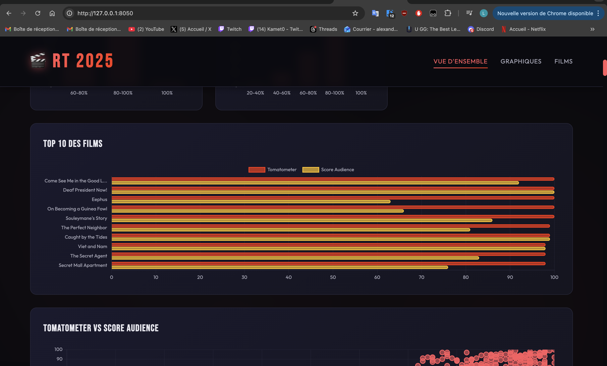

#  Scraping des films Rotten Tomatoes 2025 & Dashboard interactif

##  Présentation du projet

Ce projet a été réalisé dans le cadre du module de Data Engineering.
L’objectif était de construire une chaîne complète de traitement de données, depuis la récupération des informations sur un site web jusqu’à leur visualisation dans une application web.

Pour cela, j’ai choisi de travailler sur le site Rotten Tomatoes en récupérant les films sortis en 2025 ainsi que leurs scores critiques et spectateurs.

Le projet repose sur trois étapes principales :
scraper les données, les stocker dans une base de données, puis les afficher via un dashboard interactif.

---

##  Démarche et choix techniques

J’ai utilisé Scrapy pour réaliser le scraping car il permet de structurer proprement le code et de parcourir facilement un grand nombre de pages.
Le spider récupère d’abord la liste des films 2025, puis visite chaque page individuelle afin d’extraire les informations importantes comme le titre, le score critique (Tomatometer) et le score des spectateurs (Audience Score).

Les données sont ensuite stockées dans une base MongoDB.
Ce choix s’est imposé naturellement car MongoDB est très bien adapté aux données issues du web scraping, qui sont souvent semi-structurées et évolutives.

Pour la partie visualisation, j’ai développé une application web en Python avec Flask.
Le backend se connecte à MongoDB pour récupérer les données et les transmettre au frontend, qui affiche des graphiques et une liste des films.

Enfin, l’ensemble du projet a été conteneurisé avec Docker afin de pouvoir être lancé facilement sur n’importe quelle machine.

---

##  Architecture du projet

Le projet fonctionne selon un flux simple :

Le scraper collecte les données → les enregistre dans MongoDB → le dashboard lit la base → les données sont affichées dans l’interface web.

Trois conteneurs sont utilisés :

* MongoDB (base de données)
* Scraper (Scrapy)
* Dashboard (Flask + JavaScript)

---

##  Comment lancer le projet

Une fois Docker installé, il suffit de se placer à la racine du projet et d’exécuter :

docker compose up --build

Cette commande lance automatiquement :

* la base de données
* le scraping
* l’application web

L’interface est ensuite accessible à l’adresse :

[http://127.0.0.1:8050](http://127.0.0.1:8050)

---

##  Résultats et visualisation des données

###  Interface du dashboard

Le projet inclut un dashboard web interactif permettant d’explorer les données scrapées depuis Rotten Tomatoes.

Le dashboard constitue la seconde partie du projet après le scraping.  
Il utilise les données stockées dans MongoDB pour générer des visualisations dynamiques accessibles via un navigateur.

---

##  Fonctionnement technique du dashboard

###  Initialisation et configuration

Le script se connecte à la même base de données MongoDB que celle utilisée par le scraper afin de récupérer les films enregistrés.

---

###  Récupération des données

Les données sont chargées depuis la collection `movies` :

- titre  
- score critiques (Tomatometer)  
- score audience  
- URL du film  

Les films sont ensuite triés par score pour permettre l’analyse et l’affichage des meilleurs résultats.

---

###  Création des visualisations

Les graphiques sont générés côté front avec JavaScript / Plotly :

- Histogramme des scores Tomatometer  
- Histogramme des scores Audience  
- Distribution des notes  
- Top 10 des films les mieux notés  

---

### ️ Interface utilisateur

L’interface est organisée en onglets :

- Vue d’ensemble  
- Graphiques  
- Films  

Cela permet une navigation fluide entre les différentes analyses.

---

##  Aperçu du dashboard

### Analyse des distributions des scores

---

### Top 10 des films

---

## ️ Difficultés rencontrées

L’une des principales difficultés a été liée au scraping du site Rotten Tomatoes.
Certaines informations ne sont pas directement visibles dans le HTML classique et sont intégrées sous forme de données structurées. Il a fallu explorer la page en détail pour trouver les bonnes variables à extraire.

Un autre problème important concernait la connexion entre les conteneurs Docker et MongoDB.
Au départ, l’application n’arrivait pas à récupérer les données car elle tentait de se connecter à "localhost".
La solution a été d’utiliser le nom du service Docker ("mongo") comme adresse de connexion.

J’ai également rencontré un souci où les données étaient bien présentes dans la base mais n’apparaissaient pas dans le dashboard.
Cela venait d’une mauvaise configuration de la connexion entre le backend Flask et MongoDB.

---

##  Améliorations possibles

Le projet pourrait être enrichi de plusieurs façons :

* ajouter des filtres par score
* scraper d’autres années
* ajouter des statistiques comparatives plus avancées

---

##  Conclusion

Ce projet m’a permis de mettre en pratique plusieurs compétences importantes en data engineering :

* scraping de données web
* manipulation de bases NoSQL
* création d’API backend
* visualisation de données
* conteneurisation avec Docker

Il constitue une chaîne complète de traitement de données, de la collecte jusqu’à l’affichage.

